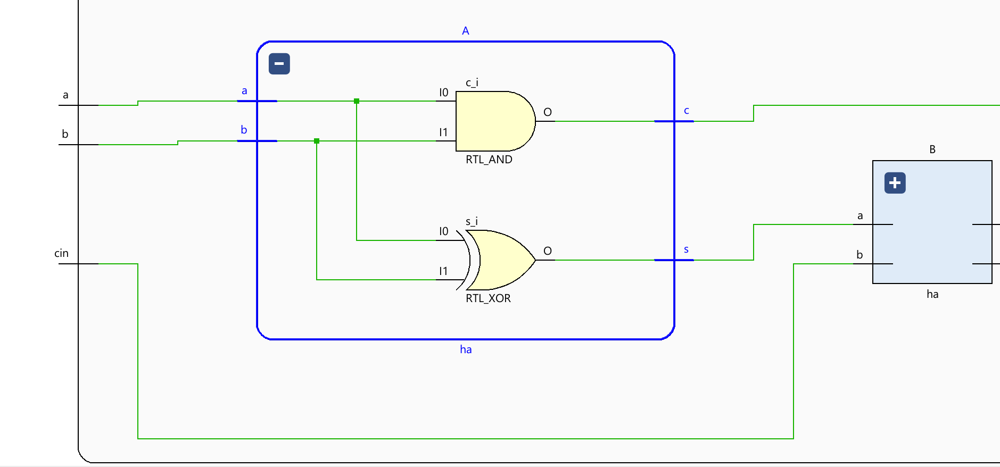
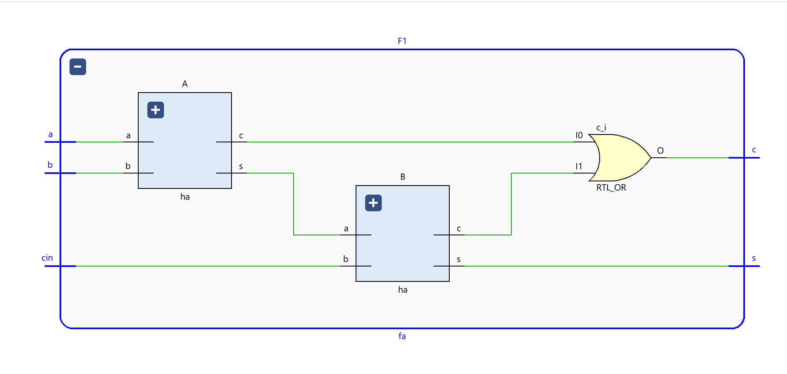
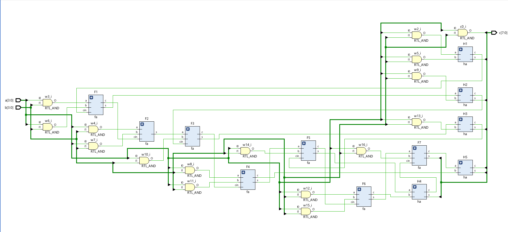
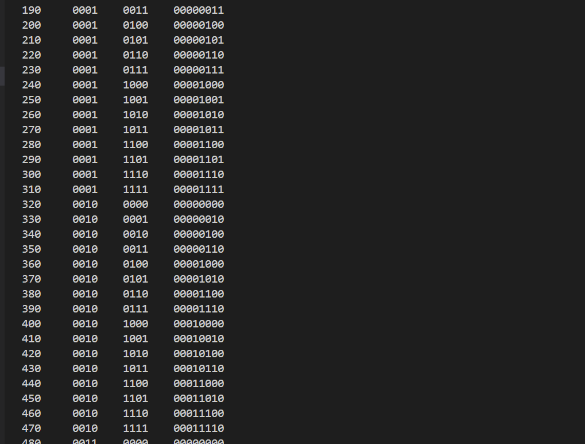
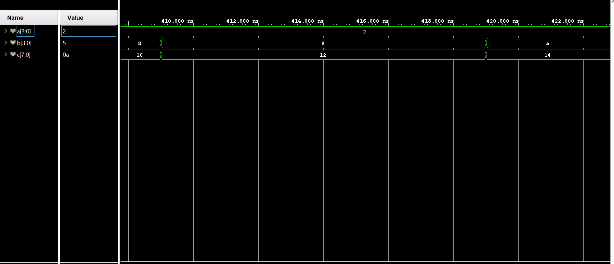
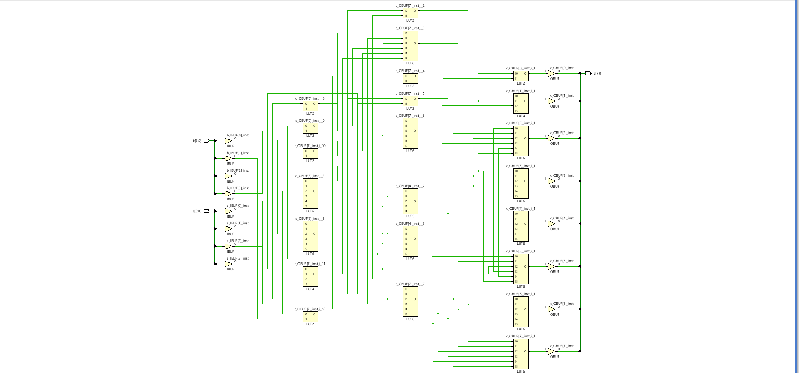

# Braun Multiplier in Verilog

A gate-level Verilog implementation of a 4x4 unsigned Braun multiplier built from basic digital design blocks. The project follows a bottom-up flow:

`Half Adder -> Full Adder -> Braun Multiplier`

This is a strong academic hardware project because it shows structural modeling, modular design, and verification across all `16 x 16 = 256` input combinations.

## Why This Project Matters

This project demonstrates:

- structural Verilog design using logic primitives
- hierarchical hardware construction from reusable modules
- understanding of partial product generation and carry propagation
- testbench-based verification for combinational arithmetic circuits


## Architecture

The multiplier is built in three layers:

1. `ha` for sum and carry generation
2. `FA/fa` using two half adders and one OR gate
3. `BM` top module for 4x4 multiplication

The design computes partial products with AND gates, reduces them through an array of adders, and produces an 8-bit output.

## Project Files

```text
Multiplier/
|-- Half Adder Module.v
|-- Half Adder Test Bench.v
|-- Full Adder using HA cascade.v
|-- Full Adder TB.v
|-- BraunMultiplierDesign.v
|-- BraunMultipliertb.v
|-- mult.vvp
|-- HalfAdder.png
|-- FullAdder.png
|-- Circuit.png
|-- HA waveform.png
|-- BM waveform.png
|-- TestResult.png
|-- FinalAnswer.png
`-- README.md
```

## Module Summary

### Half Adder

- Inputs: `a`, `b`
- Outputs: `s`, `c`
- Logic used: `xor`, `and`

### Full Adder

- Inputs: `a`, `b`, `cin`
- Outputs: `s`, `c`
- Built using two half adders and one OR gate

### Braun Multiplier

- Inputs: `a[3:0]`, `b[3:0]`
- Output: `c[7:0]`
- Uses AND-generated partial products and cascaded adders

## Verification

The verification flow is one of the strongest parts of this project:

- Half adder testbench checks all 4 input combinations
- Full adder testbench checks all 8 input combinations
- Braun multiplier testbench sweeps all 256 possible input pairs

Example:

```text
0000 x 0000 = 00000000
0101 x 0011 = 00001111
1111 x 1111 = 11100001
```

## Results

### Logic Building Blocks

#### Half Adder



#### Full Adder



### Braun Multiplier Circuit



### Simulation Waveforms

#### Half Adder Waveform


#### Braun Multiplier Waveform


### Output Snapshots





### Implemented Design 


## How to Run

You can run the design using Icarus Verilog or EDA Playground.

### Half Adder

```bash
iverilog -o ha_out "Half Adder Module.v" "Half Adder Test Bench.v"
vvp ha_out
```

### Full Adder

```bash
iverilog -o fa_out "Full Adder using HA cascade.v" "Full Adder TB.v"
vvp fa_out
```

### Braun Multiplier

```bash
iverilog -o bm_out "BraunMultiplierDesign.v" "BraunMultipliertb.v"
vvp bm_out
```

If waveform dumping is enabled in the simulator environment, open the generated `.vcd` file in GTKWave.

## Key Learnings

- translating arithmetic hardware into structural Verilog
- building larger combinational circuits from smaller verified modules
- understanding Braun array multiplier data flow
- writing simple but effective testbenches for exhaustive verification

## Author

**Adarsh Akshat**

- B.Tech, Electrical and Electronics Engineering
- GitHub: [@aadiakshat](https://github.com/aadiakshat)
